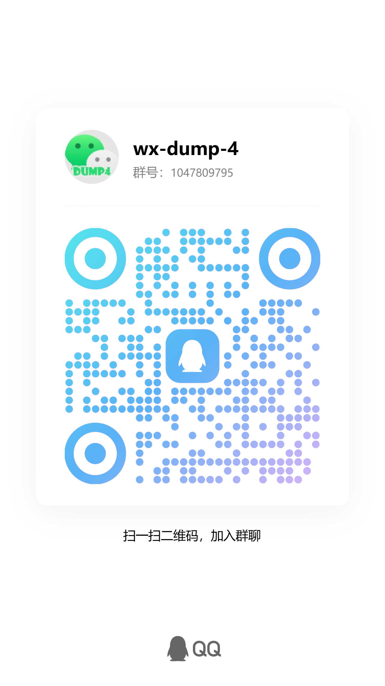

# wx-dump-4

<div align="center">
  
</div>

基于 Rust + Vue 3 的微信数据导出工具，支持微信 4.0+ 版本。

## 技术栈

### 后端
- **Rust** - 系统级编程语言，高性能
- **Axum** - 异步 Web 框架
- **windows-rs** - Windows API 绑定
- **rusqlite** - SQLite 数据库

### 前端
- **Vue 3** - 渐进式前端框架
- **Vite 8** - 下一代前端构建工具
- **UnoCSS** - 原子化 CSS 引擎
- **Pinia** - 状态管理

## 项目结构

```
wx-dump-4/
├── backend/          # Rust 后端
│   ├── src/
│   │   ├── api/      # API 路由
│   │   ├── core/     # 核心功能
│   │   ├── db/       # 数据库处理
│   │   └── models/   # 数据模型
│   └── Cargo.toml
├── frontend/         # Vue 前端
│   ├── src/
│   │   ├── views/    # 页面
│   │   ├── components/ # 组件
│   │   └── api/      # API 调用
│   └── package.json
└── README.md
```

## 开发

### 后端开发

```bash
cd backend
cargo run
```

后端服务运行在 `http://localhost:3000`

### 前端开发

```bash
cd frontend
npm install
npm run dev
```

前端服务运行在 `http://localhost:5173`

## 功能特性

- ✅ 获取微信信息（版本、账号、昵称、手机号等）
- ✅ 支持微信 4.0+ 版本
- ✅ 数据库解密
- 🔄 聊天记录查看（开发中）
- 🔄 数据导出（开发中）

## 注意事项

- 需要管理员权限运行（用于读取进程内存）
- 仅支持 Windows 系统
- 仅供学习交流使用

## 许可证

本项目采用MIT许可证。

## 贡献

欢迎提交Issue和Pull Request！

## 支持项目

如果这个项目对你有帮助，欢迎通过微信赞赏支持开发者继续改进项目！

<div align="center">
  
  <p><em>你的鼓励是我改BUG的动力 💪</em></p>
</div>

## 技术支持

遇到问题需要帮助？欢迎加入付费技术支持咨询交流QQ群，与开发者和其他用户交流！

<div align="center">
  
  <p><em>扫码加入QQ群，获取技术支持 💬</em></p>
</div>

